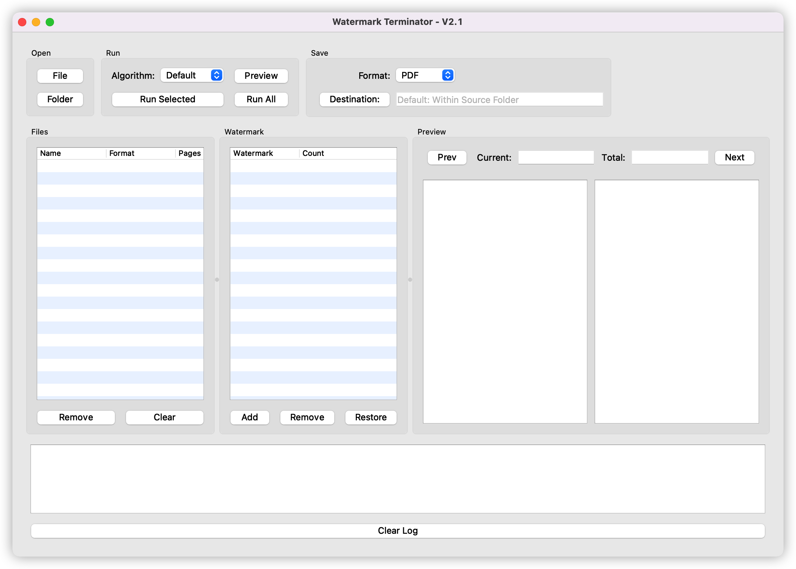
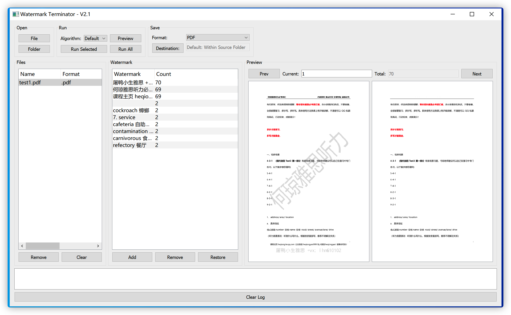
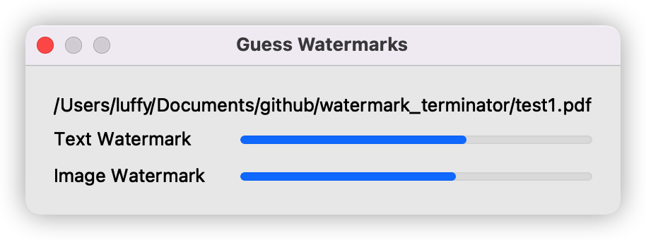
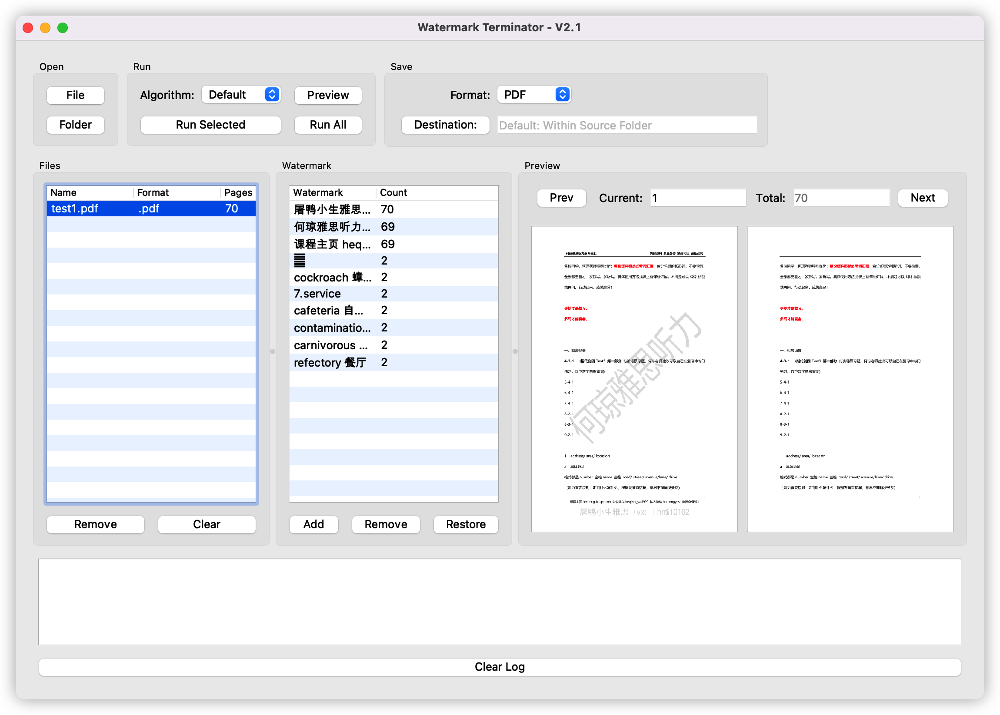
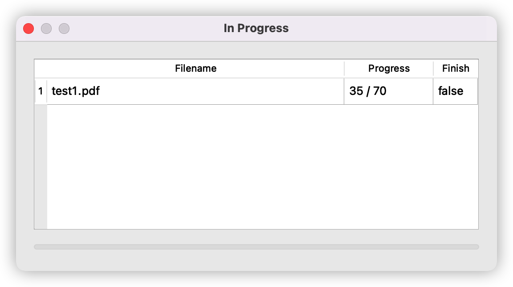
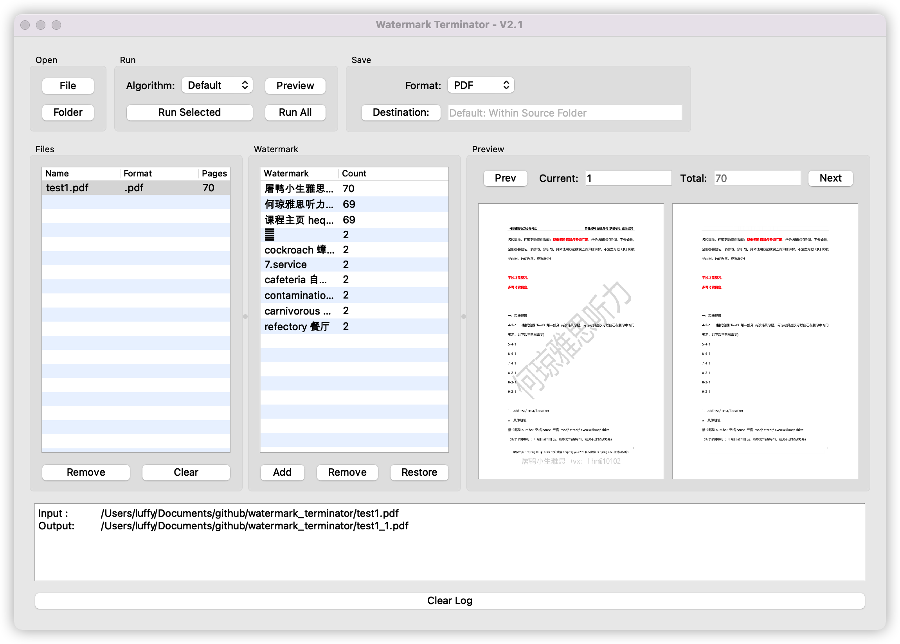
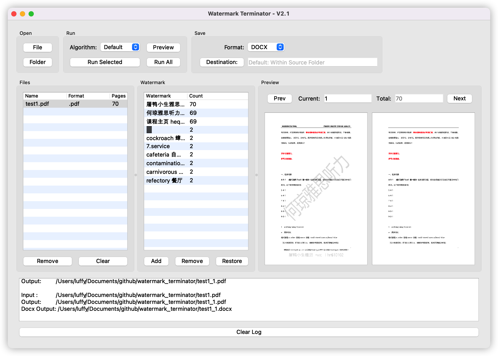

# Watermark Terminator(水印终结者)

Remove text and/or image watermarks in PDF files and output PDF and/or DOCX files.

## Features

- Open source, UI based, single file, fully written in Python
- Automatically detect (i.e., guess) possible watermarks
- Support editing what watermarks to remove
- Support add customized text watermarks
- Support preview for each page
- Support output to PDF and/or DOCX files
- Support multi-thread via QThread
- Support MacOS and Windows (TESTED)
- Indicate processing progress
- Support to build as standalone executable
- NOT SUPPORT THOSE PDF FILES WHOSE CONTENT IS IMAGE

## Preview

**The pdf file for demonstration was downloaded from the Internet.**

- Main UI (Mac)



- Main UI (Windows)



- Detect (Guess) Watermarks



- Preview Result



- Processing



- Output PDF



- Output DOCX



## Pre-built

- MacOS

[WatermarkTerminator-2.1-mac.zip](dist/WatermarkTerminator-2.1-mac.zip)

- Windows

[WatermarkTerminator-2.1-win.zip](dist/WatermarkTerminator-2.1-win.zip)

## Simplest Manual

- Run Application

- Open File / Folder

> Folders mean that files there have the same kind of watermarks.

- Click file to guess watermarks

- Edit (add or remove) watermarks

    - Add only supports add text watermarks
    - Remove supports both image and text
    - Click Restore to reset with guessed watermarks
    - The second column Count means that how many times this possible watermarks have appeared.

**Trick: It probably must be a watermark if the count equals the pages count of the file.**

**Each time you click the files, the guessing process will run.**

- Click Preview

    - Click Prev for previous page
    - Click Next for next page
    - Enter a valid number and press return to jump to that page

- Select Output Format If Needed

- Click Destination: to Set Output Folder If Needed

- Run Selected / Run All

- Wait And See The Log Window Output

**Tip: If you wanna process files in a folder, you should click a file ONCE. It means to guess watermarks ONCE since all
files have the same watermarks.After Guessing, edit the watermarks, preview, and then run.**

## Dev Env

- MacOS

- PyCharm

- conda env file
    - MacOS

  see `wt-mac.yml`, output by [conda-env-export](https://pypi.org/project/conda-env-export/)

    - Windows

  see `wt-win.yml`, output by [conda-env-export](https://pypi.org/project/conda-env-export/)

- Run

```bash
pytho main.py
```

- Build

```bash
pyinstaller --windowed --onefile --clean --noconfirm --hidden-import PyQt5.QtXml main.py --name WatermarkTerminator
```

## Tips

### Dev env setup under MacOS

- conda

conda env create -f wt.yml

- poppler

wget https://poppler.freedesktop.org/poppler-21.04.0.tar.xz

tar -zxf poppler-21.04.0.tar.xz cd poppler-21.04.0

```bash
mkdir build
cd build
cmake ..
make
make install
```

- python-poppler-qt5

git clone https://github.com/frescobaldi/python-poppler-qt5

cd python-poppler-qt5

python setup.py build

python setup.py install

- sip

wget https://sourceforge.net/projects/pyqt/files/sip/sip-4.19.8/sip-4.19.8.tar.gz

- check sip

```python
import sipconfig

print(sipconfig.Configuration().default_sip_dir)
# return os.path.join(sipconfig.Configuration().default_sip_dir, 'PyQt5')
```

### Dev env setup under Windows

Refer [https://github.com/luffy-yu/python-poppler-qt5](https://github.com/luffy-yu/python-poppler-qt5)

## Reference for setting dev env

- [Windows平台poppler-qt5预编译库](https://blog.xiadong.info/2016/03/16/windows%E5%B9%B3%E5%8F%B0poppler-qt5%E9%A2%84%E7%BC%96%E8%AF%91%E5%BA%93/)

- [libpoppler-qt5-devel](http://ftp.vcu.edu/pub/windows/cygwin/x86_64/release/poppler/libpoppler-qt5-devel/)